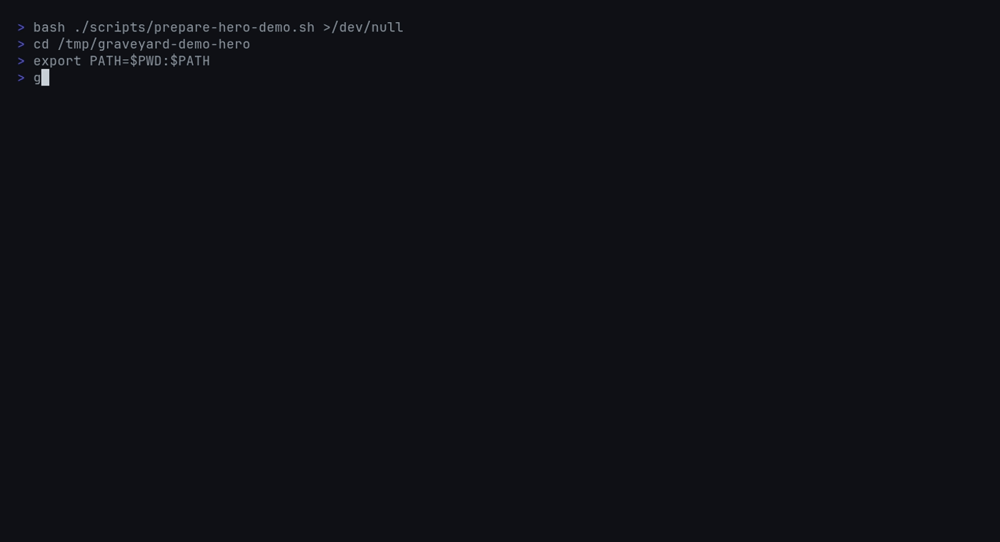

[](https://github.com/Meru143/graveyard/actions/workflows/ci.yml)
[](https://github.com/Meru143/graveyard/stargazers)
[](https://crates.io/crates/graveyard)
[](https://pypi.org/project/graveyard/)
[](https://www.npmjs.com/package/graveyard-cli)
[](LICENSE)

# graveyard

`graveyard` finds dead code across Python, JS/TS, Go, and Rust with one scan.

It is built for mixed-language repos where the usual answer is "run a different dead-code tool per ecosystem, then stitch the output together yourself." `graveyard` gives you one ranked report, one CI ratchet, and one CLI to install.

AI coding agents make dead code cheaper to create than to notice. `graveyard` answers that with a cross-language reference graph, git-aware confidence scoring, and baseline workflows that let teams ratchet new dead code without stopping to clean the whole backlog first.

- One pass across Python, JavaScript, TypeScript, Go, and Rust
- Git-aware confidence scoring based on deadness age, references, scope, and churn
- Baseline diff mode for CI ratchets
- Table, JSON, CSV, and SARIF output for local use and automation

```bash
graveyard scan --ci --min-confidence 0.80
graveyard baseline diff --baseline .graveyard-baseline.json --ci
```



If this is the dead-code workflow you wanted for mixed-language repos, star the repo so more teams can find it.

## Why graveyard exists

Most dead-code tooling is still organized by language silo. That works fine until a repository mixes Python services, TypeScript apps, Go tooling, and Rust infrastructure. At that point the problem is no longer "find unused code in one ecosystem." The problem is "give the team one dead-code workflow they can trust."

`graveyard` is the wedge for that workflow. It walks a repository once, extracts symbols with tree-sitter, builds a unified reference graph, folds in git history, then emits a ranked report that works locally and in CI.

## Why this is different

`graveyard` is designed around adoption, not just detection:

- Mixed-language first. The scanner is manifest-aware, so `pyproject.toml`, `package.json`, `go.mod`, and `Cargo.toml` shape language detection automatically.
- Ranking instead of raw dumps. Findings are scored with age of deadness, reference count, symbol scope, and recent churn so public APIs and fresh code do not dominate the queue.
- CI ratchets built in. `graveyard baseline save` and `graveyard baseline diff --ci` let a team block new dead code without demanding a one-shot cleanup of the entire backlog.
- Output that plugs in. Use the table locally, JSON or CSV in automation, and SARIF when you want findings to surface in GitHub code scanning.

## When to use graveyard vs other tools

| If you need | Best fit | Why |
| --- | --- | --- |
| Python-only dead-code checks | `vulture` | Mature single-language choice for Python repos |
| JS/TS workspace cleanup | `knip` | Strong fit for JavaScript and TypeScript dependency and export analysis |
| Unused Rust dependencies | `cargo-machete` | Focused on dependency pruning, not cross-language source dead code |
| One dead-code workflow across Python, JS/TS, Go, and Rust | `graveyard` | One scan, one ranking model, one CI ratchet |

`graveyard` is not trying to replace dependency-pruning tools such as `cargo-machete`. Its job is the source-code layer: one ranked dead-code report across a polyglot repository instead of separate outputs from multiple ecosystems.

## Distribution

`graveyard` is published on crates.io, PyPI, npm, and Homebrew. The release pipeline verifies Rust stable and beta across Linux, macOS, and Windows, publishes versioned artifacts, and smoke-tests `cargo install graveyard`, `pip install graveyard`, and `npm install -g graveyard-cli` before the release closes.

## Installation

### pip / pipx

```bash
pip install graveyard
pipx install graveyard
uvx graveyard --version
```

### npm

```bash
npm install -g graveyard-cli
graveyard --version
```

### cargo

```bash
cargo install graveyard
graveyard --version
```

### Homebrew

```bash
brew tap Meru143/homebrew-tap
brew install graveyard
graveyard --version
```

## Quick Start

Run a scan in the current repository:

```bash
graveyard scan
```

Start with time-based filtering when you are adopting the tool in an existing repository:

```bash
graveyard scan --min-age 30d
graveyard scan --min-age 30d --min-confidence 0.7
```

Use CI gating when you want stricter policy enforcement:

```bash
graveyard scan --ci --min-confidence 0.8
```

Sample terminal output:

```text
CONFIDENCE  TAG               AGE         LOCATION                  FQN
0.94        ExportedUnused    1.1 years   src/lib.rs:42             src/lib.rs::legacy::old_api
0.88        Dead              8 months    services/api/foo.py:17    services/api/foo.py::cleanup_task
Found 2 dead symbol(s) - min-confidence 0.8, min-age 30 days
```

## Usage

The default scan targets the current directory and prints a ranked table:

```bash
graveyard scan
graveyard scan ./services/api
graveyard scan --top 25
graveyard scan --format json
graveyard scan --format sarif --output graveyard.sarif
graveyard scan --format csv --output graveyard.csv
```

Time-based filtering is the fastest way to start in a repository with backlog:

```bash
graveyard scan --min-age 7d
graveyard scan --min-age 30d --min-confidence 0.7
graveyard scan --min-age 1y --ignore-exports
```

Repository-specific controls map directly to the implemented flags:

```bash
graveyard scan --exclude "vendor/**" --exclude "generated/**"
graveyard scan --baseline .graveyard-baseline.json
graveyard scan --no-git
graveyard scan --no-cache
graveyard scan --cache-dir ~/.cache/graveyard
graveyard scan --config .graveyard.toml
graveyard scan -v
graveyard scan -vv
```

Baseline management and language detection are first-class commands:

```bash
graveyard baseline save --output .graveyard-baseline.json
graveyard baseline diff --baseline .graveyard-baseline.json
graveyard baseline diff --baseline .graveyard-baseline.json --ci
graveyard languages
graveyard completions bash > ~/.local/share/bash-completion/completions/graveyard
graveyard completions zsh > ~/.zfunc/_graveyard
graveyard completions fish > ~/.config/fish/completions/graveyard.fish
graveyard completions powershell > graveyard.ps1
```

## CI Adoption

The ratchet workflow is the cleanest way to add `graveyard` to an existing codebase because it only fails the build when a pull request introduces new dead code relative to a stored baseline.

```yaml
name: Dead Code

on:
  pull_request:
  push:
    branches:
      - main

jobs:
  graveyard:
    runs-on: ubuntu-latest
    steps:
      - uses: actions/checkout@v5
      - uses: actions/setup-python@v6
        with:
          python-version: "3.12"
      - name: Install graveyard
        run: pip install graveyard
      - name: Enforce new dead code only
        run: graveyard baseline diff --baseline .graveyard-baseline.json --ci
```

If you do not need a ratchet, replace the final command with `graveyard scan --ci --min-confidence 0.8`. SARIF output is available through `graveyard scan --format sarif --output graveyard.sarif` when you want to upload findings into GitHub code scanning.

This repository keeps its own GitHub Actions split into two workflows. `CI` runs on pull requests into `main` and on pushes to `main`, then reports a single protected summary check named `CI` after the matrix finishes. `Release` does not run on ordinary commits; it only runs for semver tags such as `v0.1.2` or through manual dispatch.

## Configuration

`graveyard` resolves settings in this order: CLI flags, `.graveyard.toml`, environment variables, then built-in defaults. The configuration file lives at `.graveyard.toml` by default and supports the full v1 surface.

```toml
[graveyard]
min_confidence = 0.6
min_age = "30d"
fail_on_findings = false
top = 0
format = "table"
output = "graveyard-report.json"
exclude = ["migrations/**", "**/generated/**"]
ignore_exports = false
baseline = ".graveyard-baseline.json"
no_git = false
no_cache = false

[scoring]
age_weight = 0.35
ref_weight = 0.30
scope_weight = 0.20
churn_weight = 0.15
age_max_days = 730
age_min_days = 7

[ignore]
names = ["legacy_*", "TODO_*", "test_*"]
files = ["migrations/**", "**/generated/**", "**/vendor/**"]
decorators = ["@pytest.fixture", "@app.route"]

[languages]
enabled = ["python", "javascript", "typescript", "go", "rust"]

[entry_points]
names = ["main", "__main__", "app", "handler", "create_app"]

[cache]
enabled = true
dir = "~/.cache/graveyard"
```

The `GRAVEYARD_MIN_CONFIDENCE` environment variable can override the default confidence threshold when the config file leaves it unset. `NO_COLOR` and `GRAVEYARD_NO_COLOR` both disable ANSI color output.

## Understanding Scores

`--min-age` is the intended on-ramp because it maps directly to how engineers reason about stale code. If a symbol has had no meaningful touch for thirty days and still has zero reachable callers, it belongs high in the queue even before anyone thinks about the full formula.

`--min-confidence` exposes the full score for CI and team policy work. The score is a weighted sum of four factors: age of deadness, reference count, symbol scope, and recent churn. Local private functions with no callers and no recent history score higher than public APIs or code that changed this week.

```text
confidence =
  0.35 * age_factor(deadness_age_days)
  0.30 * ref_factor(in_degree)
  0.20 * scope_factor(symbol)
  0.15 * churn_factor(commits_90d)
```

Those weights are configurable in `[scoring]`, but they must still sum to `1.0`. Use `--ignore-exports` when a repository has many intentionally public APIs and you only want truly unreachable internals.

## Language Support

| Language | Status | Notes |
| --- | --- | --- |
| Python | Yes | Functions, classes, `__all__`, decorator-aware extraction |
| JavaScript | Yes | Functions, arrow functions, exports, `export * from` |
| TypeScript | Yes | JS support plus interfaces, type aliases, TSX parsing |
| Go | Yes | Functions, methods, exported identifier detection |
| Rust | Yes | Functions, methods, structs, enums, `pub` visibility, test attributes |
